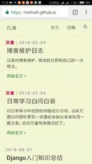

# hexo-theme-conscious

一个hexo博客主题，在[hexo-theme-cafe](https://github.com/giscafer/hexo-theme-cafe)的基础上修改而成

# 效果

### [demo](https://michwh.github.io/)




# 使用

## 安装

```bash
git clone https://github.com/michwh/hexo-theme-conscious.git themes/conscious
```

或者直接下载最新源码文件，重命名为conscious放到博客themes目录下

## 使用

修改博客配置文件 `_config.yml` 主题属性 theme 为 `conscious`，并将博客地址改成`/post/:title/`这种形式

```
# URL
permalink: /post/:title/

# Extensions
## Plugins: https://hexo.io/plugins/
## Themes: https://hexo.io/themes/
theme: conscious
```

## 更新

```bash
cd themes/conscious
git pull
```
